# 🏫 IS216 Web Application Development II

---

## Section & Group Number
G4 Group 16  

---

## Group Members

| Photo | Full Name | Role / Features Responsible For |
|:--:|:--|:--|
|  | Soh De Lin Nicholas | Seller Dashboard, Profile Page |
|  | Darren Ng Yi Jie | Note Recommendation System and Upload Notes flow |
|  | Joel Ow | Backend Management, Note listing and Detail listing |
|  | Ashley Toh | Backend Management, Payments and Forum |
|  | Sim Jun Zhi Dylan | Order Details and Composing Notes UI |
|  | Ashwin | Overall Styling of Web Application and Roadmap Module Page |

> Place all headshot thumbnails in the `/photos` folder (JPEG or PNG).

---

## Business Problem

The community problem our project aims to address is that we realise the process of purchasing notes in SMU to be a cumbersome process. Currently, a solution that exists is the AskSMU channel in Telegram, in which students can liase with sellers through the Education Resources topic in the channel. However, this would mean offline communication, handling of payments, and sending of files. Such way of notes distribution and purchase is cumbersome. 

Further research on competitors shows that Studocu and CourseHero aims to solve similar issues. However, these notes on AskSMU do not have these notes being listed on the platforms. Upon further research, we realise the lack of incentivisation on the current platforms being a missing gap as to why the notes are not being published. Thus, we aim to build a marketplace that allows SMU students to purchase and sell notes for the community;.

---

## Web Solution Overview

### 🎯 Intended Users
- SMU Students who are in need of notes for their modules
- SMU Studens who would want to sell their notes and earn some quick cash.

### 💡 What Users Can Do & Benefits

| Feature | Description | User Benefit |
|:--|:--|:--|
| Register & Login | Secure authentication system | Personalized experience and data security |
| Product Listing | View all notes within the web application | Users can view these notes and make a selection based on their wants. |
| Note Recommendation System | Find notes based on modules you have taken and time of the semester | Allows students to have quick access of the modules they are taking without having to search |
| Semantic Search | Allows for search based on note content and embeddings generated rather than normal text search | Quick search for notes users would need. |
| Node based knoweldge graph  | Users can view informaton about their notes in the form of a graph, connecting different concepts and the relation between them as edges | Users can understand the meaning of the notes in a visual manner without much viewing before purchasing |
| Forum | Buyers can leave comments and question on certain parts of the notes they own for sellers. Sellers can answer these questions. | Creates a form of communication between buyers and sellers after purchasing a certain note for clarification. |
| Seller Dashboard | Sellers can view key metrics on the notes they sold and their performance.  | Sellers can analyse and know how to improve on their sales. They would know which notes to sell, and at certain price points. |
| Compose Notes | Rather than uploading notes, sellers can write their own notes within the application and post them as articles for students to view.  | Sellers can create notes on the go, rather than uploading a certain note in their computer. |
| Payment for notes | Students can purchase their notes on the application.  | Allows student to link their card and pay via stripe API. |
---

## Tech Stack

### 🧱 Tech Stack Overview

#### Frontend
| Logo | Technology | Purpose / Usage |
|:--:|:--|:--|
|  | **React** | Frontend framework for building dynamic user interfaces |
|  | **TailwindCSS** | Utility-first CSS framework for styling and responsive layouts |
|  | **Shadcn/UI** | Pre-built accessible UI components styled with TailwindCSS |
|  | **Vite** | Lightning-fast development server and build tool |

#### Backend
| Logo | Technology | Purpose / Usage |
|:--:|:--|:--|
|  | **AWS Amplify** | Hosting and CI/CD for the frontend React app |
|  | **Node.js** | JavaScript runtime for backend execution |
|  | **TypeScript** | Strongly-typed superset of JavaScript for maintainable backend code |
|  | **Express.js** | Web framework for building RESTful APIs |
|  | **Docker** | Containerization for backend services |
|  | **AWS Cognito** | User authentication and authorization service |
|  | **AWS ECS** | Container orchestration for backend microservices |

#### Data
| Logo | Technology | Purpose / Usage |
|:--:|:--|:--|
|  | **MongoDB** | NoSQL database for document-oriented data storage |
|  | **Supabase** | Postgres-based backend-as-a-service for structured data |
|  | **AWS S3** | Object storage for images, files, and note uploads |
|  | **RabbitMQ** | Message broker for asynchronous communication between services |

---

## Use Case & User Journey

Provide screenshots and captions showing how users interact with your app.

1. **Landing Page**  
   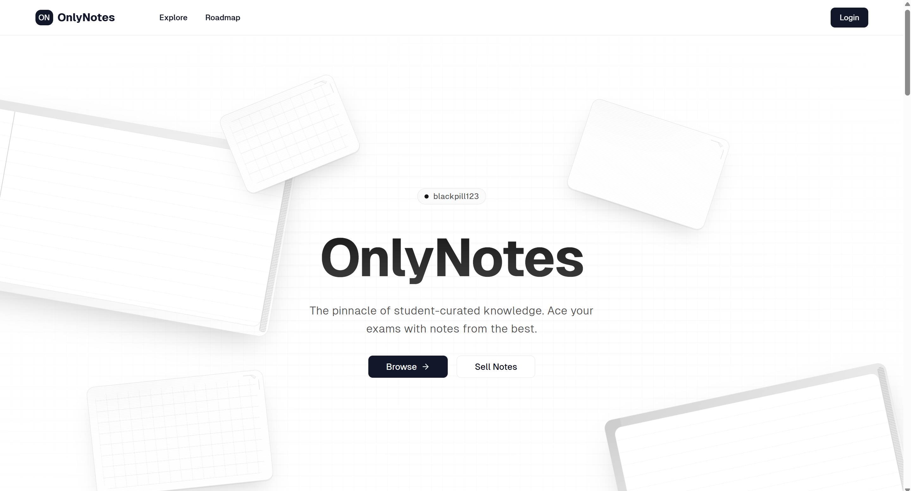  
   - Displays the homepage introducing OnlyNotes with options to browse or sell notes, followed by sections highlighting platform benefits, step-by-step guides for buyers and sellers, curated study roadmaps for guidance, and recommended notes.

2. **Register & Login**  
   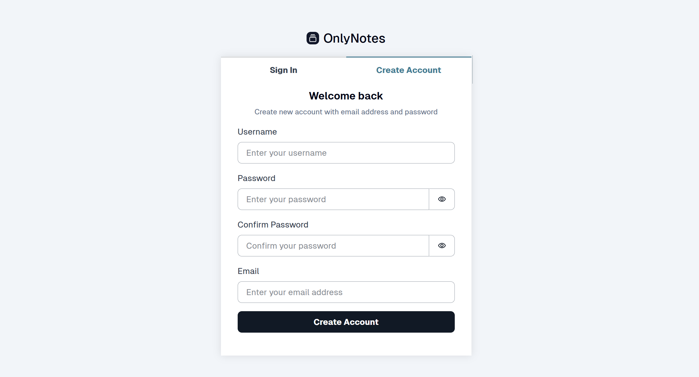  
   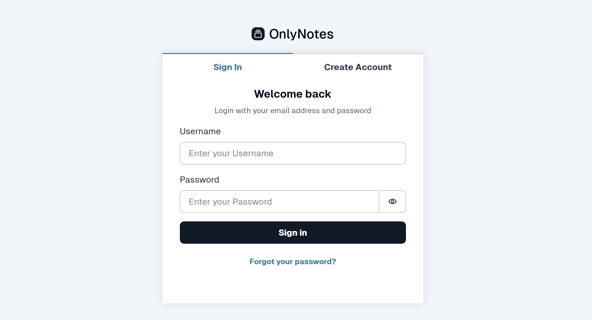  
   - Users can register for an account and login.

3. **Note Recommendation System**  
   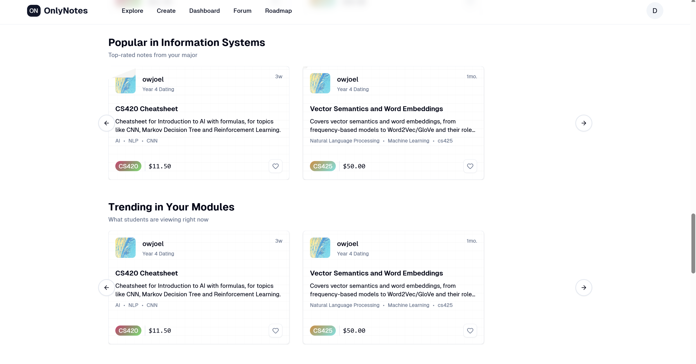  
   - Users can find notes based on modules they have taken and time of the semester

4. **Product Listing**  
   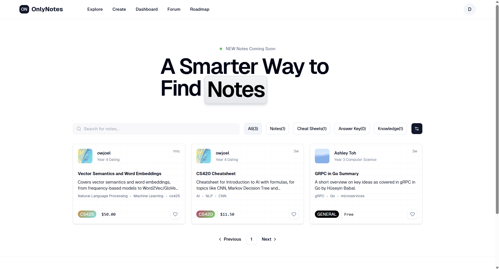  
   - Users are able to view notes put up by other users.

5. **Semantic Search**  
   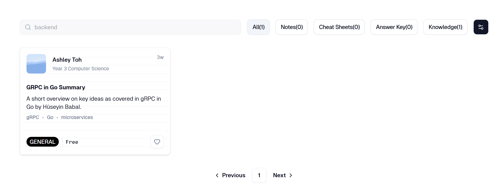  
   - User can search based on note content and embeddings generated rather than normal text search.

6. **Node based knowledge graph**  
   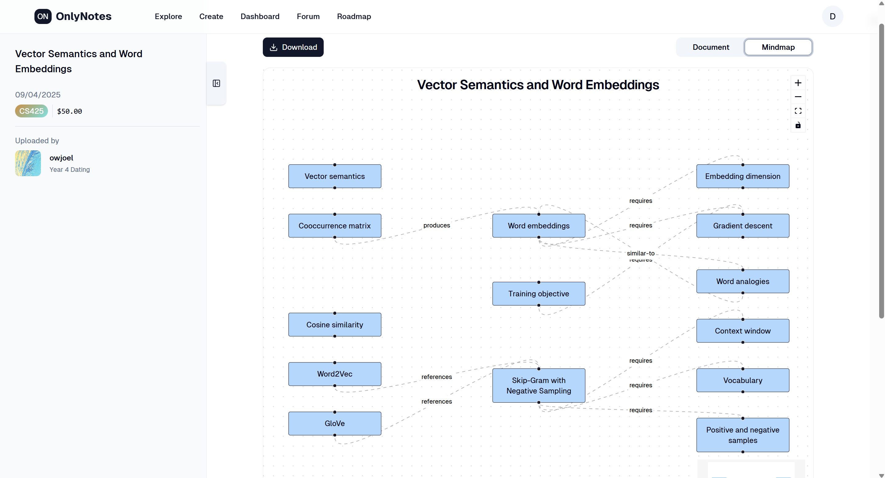  
   - Users can view their notes in a graph view showing connected concepts and relationships. 

7. **Forum**  
   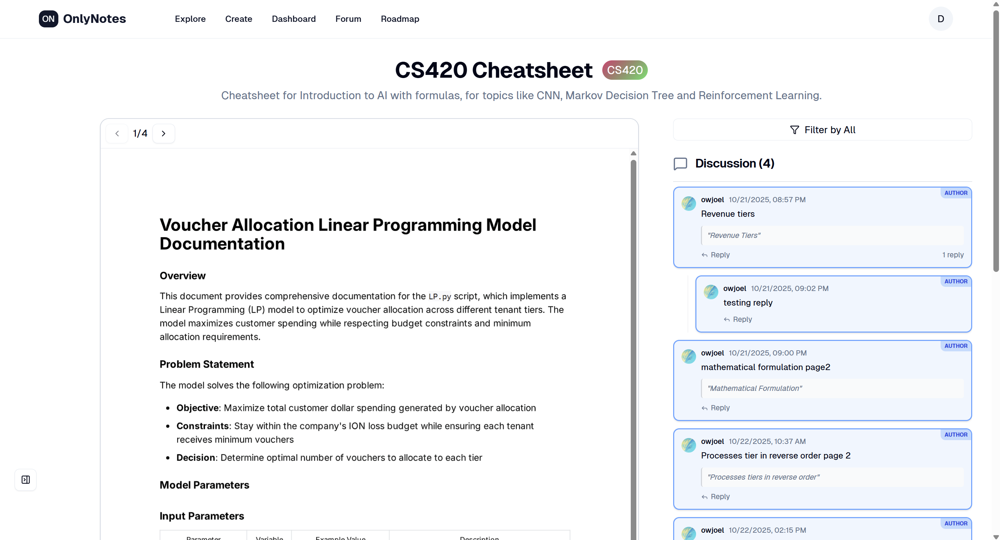  
   - Users can communicate with sellers regarding their purchased notes.

8. **Seller Dashboard**  
   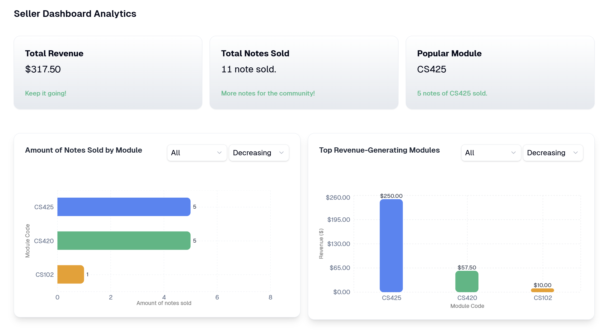  
   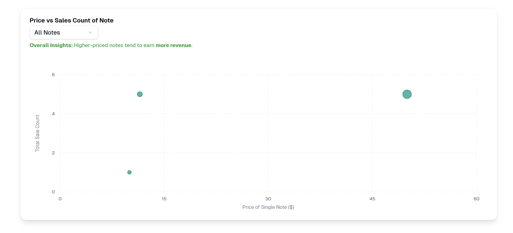  
   - Users can view key metrics regarding the performance of their notes.

9. **Compose Notes**  
   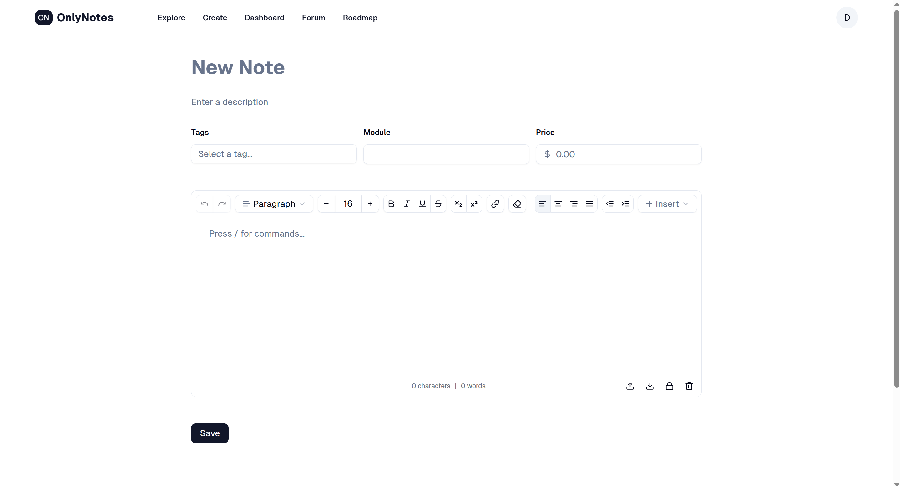  
   - Users can choose to create and upload their own notes.


> Save screenshots inside `/screenshots` with clear filenames.

---

## Developers Setup Guide

Comprehensive steps to help other developers or evaluators run and test your project.

---

### 0) Prerequisites
- [Git](https://git-scm.com/) v2.4+  
- [Node.js](https://nodejs.org/) v18+ and npm v9+  
- Access to backend or cloud services used (Firebase, MongoDB Atlas, AWS S3, etc.)

---

### 1) Download the Project
```bash
git clone https://github.com/<org-or-user>/<repo-name>.git
cd <repo-name>
npm install
```

---

### 2) Configure Environment Variables
Create a `.env` file in the root directory with the following structure:

```bash
VITE_API_URL=<your_backend_or_firebase_url>
VITE_FIREBASE_API_KEY=<your_firebase_api_key>
VITE_FIREBASE_AUTH_DOMAIN=<your_auth_domain>
VITE_FIREBASE_PROJECT_ID=<your_project_id>
VITE_FIREBASE_STORAGE_BUCKET=<your_storage_bucket>
VITE_FIREBASE_MESSAGING_SENDER_ID=<your_sender_id>
VITE_FIREBASE_APP_ID=<your_app_id>
```

> Never commit the `.env` file to your repository.  
> Instead, include a `.env.example` file with placeholder values.

---

### 3) Backend / Cloud Service Setup

#### Firebase
1. Go to [Firebase Console](https://console.firebase.google.com/)
2. Create a new project.
3. Enable the following:
   - **Authentication** → Email/Password sign-in
   - **Firestore Database** or **Realtime Database**
   - **Hosting (optional)** if you plan to deploy your web app
4. Copy the Firebase configuration into your `.env` file.

#### Optional: Express.js / MongoDB
If your app includes a backend:
1. Create a `/server` folder for backend code.
2. Inside `/server`, create a `.env` file with:
   ```bash
   MONGO_URI=<your_mongodb_connection_string>
   JWT_SECRET=<your_jwt_secret_key>
   ```
3. Start the backend:
   ```bash
   cd server
   npm install
   npm start
   ```

---

### 4) Run the Frontend
To start the development server:
```bash
npm run dev
```
The project will run on [http://localhost:5173](http://localhost:5173) by default.

To build and preview the production version:
```bash
npm run build
npm run preview
```

---

### 5) Testing the Application

#### Manual Testing
Perform the following checks before submission:

| Area | Test Description | Expected Outcome |
|:--|:--|:--|
| Authentication | Register | User will be prompted to fill in more details on accountCreation page. Upon filling details, it will redirect user to home page |
| Authentication | Login | User successfully logins and he will be redirected to homepage and be able to access /profile page. |
| Authentication | Logout | User successfully signs out, and user state changes (navigation bar will not show the name.) |
| CRUD Operations | Add, Edit, Delete data | Database updates correctly |
| Responsiveness | Test on mobile & desktop | Layout adjusts without distortion |
| Navigation | All menu links functional | Pages route correctly |
| Error Handling | Invalid inputs or missing data | User-friendly error messages displayed |

#### Automated Testing (Optional)
If applicable:
```bash
npm run test
```

---

### 6) Common Issues & Fixes

| Issue | Cause | Fix |
|:--|:--|:--|
| `Module not found` | Missing dependencies | Run `npm install` again |
| `CORS policy error` | Backend not allowing requests | Enable your domain in CORS settings |
| `.env` variables undefined | Missing `VITE_` prefix | Rename variables to start with `VITE_` |
| `npm run dev` fails | Node version mismatch | Check Node version (`node -v` ≥ 18) |

---

## Group Reflection

Each member should contribute 2–3 sentences on their learning and project experience.

> - *Nicholas:* Learned to build user-friendly frontend based on components by UI libraries and customisation of these libraries. The experience has allowed me to become stronger in data manipulation to present my data in a logical manner.
> - *Ashley:* Learned to build reusable Vue components and manage state effectively.  
> - *Ashwin:* Gained experience connecting frontend and backend APIs.  
> - *Darren:* Learnt to hook up backend api endpoints to frontend and learnt more about UI librares like shadcn and how they work under the hood. This experience has gave move exposure on the structure of frontend like components, props and layout and how to break each design of frontends into reusuable and neat components.   
> - *Dylan:* Gained hands-on experience creating responsive and user-friendly web interfaces, integrating various libraries to enhance functionality and design. The project helped me to understand the overall structure of a full working web application and how frontend components connect with backend logic.  
> - *Joel:* Understood how Firebase Authentication and Firestore integrate with modern SPAs.  

As a team, reflect on:
- Key takeaways from working with real-world frameworks  
- Challenges faced and how they were resolved  
- Insights on teamwork, project management, and problem-solving  
